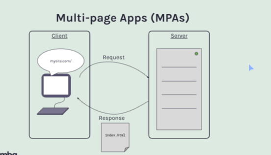
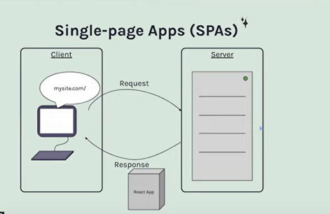
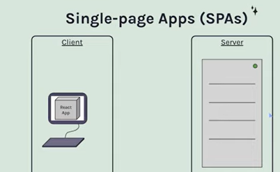
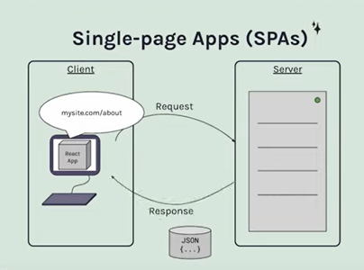
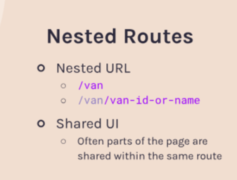
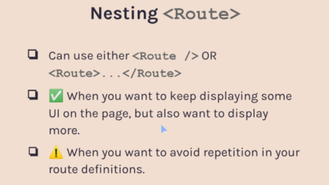
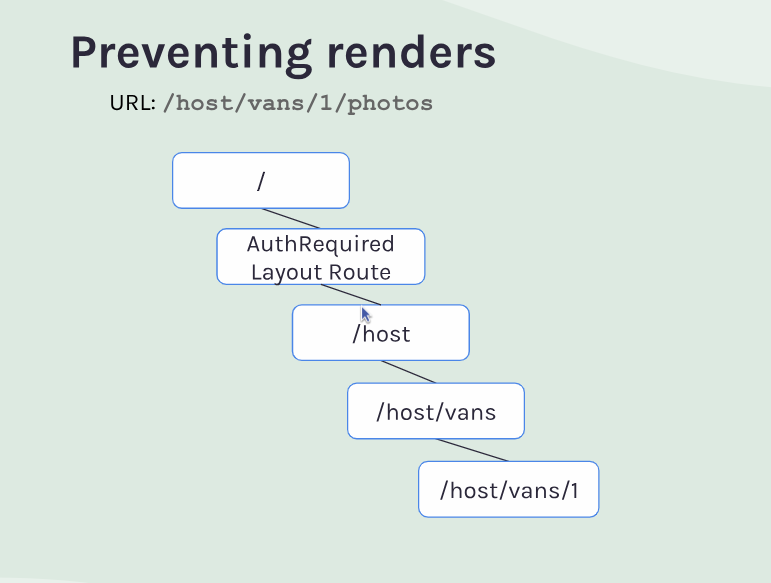
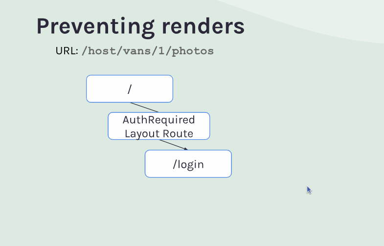

- [React Router](#react-router)
    - [Multiple Page Application \& Single Page Application](#multiple-page-application--single-page-application)
    - [React Router Setup \& BrowserRoute](#react-router-setup--browserroute)
    - [Routes](#routes)
    - [Link](#link)
    - [useParam](#useparam)
    - [Nested Routes](#nested-routes)
      - [Outlet](#outlet)
        - [Relative Paths (Routes)](#relative-paths-routes)
        - [IndexRoutes](#indexroutes)
      - [To nest or no to nest](#to-nest-or-no-to-nest)
      - [NavLink](#navlink)
        - [end](#end)
        - [Relative Links](#relative-links)
      - [Outlet Context](#outlet-context)
    - [Search/Query Parameters](#searchquery-parameters)
      - [UseSearchParams](#usesearchparams)
        - [Merge Existing QueryParameters](#merge-existing-queryparameters)
      - [**Link State** So You Don't Loose Your Filters While Navigate Around](#link-state-so-you-dont-loose-your-filters-while-navigate-around)
      - [useLocation](#uselocation)
    - [404 Page](#404-page)
    - [Happy vs. Sad Paths](#happy-vs-sad-paths)
      - [Data Layer API's](#data-layer-apis)
        - [Loaders](#loaders)
    - [Protected Routes](#protected-routes)
      - [Navigate](#navigate)
        - [Navigation State](#navigation-state)
    - [History Stack](#history-stack)
    - [Extra](#extra)
    - [Quizes](#quizes)

# React Router

`npm install react-router-dom`
is a library used to enabling _Client Side Routing_

- [MPA & SPA]

### Multiple Page Application & Single Page Application

to understand what is _Client Side Routing_ we need to take a look of MPA&&SPA history

_What is the difference between these two ?_
**MPA**
in a more traditional web site we have **MPA** *the client is the browser* and *the server which is just a computer that usually lives outside or some where else*
so when we go to the browser and navigate a website let's say _mysite.com_ a simplified version of what happen is a request is made to the server thats associate with the domain of _mysite.com_ and is request the HTML page that needed to display the webPage and at that point the server will do some processing it will grab the HTML page and it will also might evaluating some CSS or JS it could potentially be reaching out to a DATABASE or making API calls to other servers in the end with ultimate goal of putting together a completed _home page_ to send back to the browser in form of HTML file, that HTML file is send back as a response from the sever to our browser and our browser then load that page for us to view


so then when we are look to at _home page_ we can go and click on _about page_ the url for this may will be _mysite.com/about_ which would then perform another request to the server the server again will would go to the same process as before, then deliver the page to the browser and the browser then will replace the _old home page_ with _new about page_

<!-- TODO adding gif about MPA  -->

<!-- from the browser infront of us it might look something more like the entirety of that page is discarded and replaced with entirety of the new page like a flicker and that tell tale flicker is a good way to know tha tyou are currenlty looking on at a MPA -->
The browser display in front of us might appear as a complete replacement of the current page with the new one, like a flicker.  That telltale flicker is a good indicator that you are viewing a Multi-Page Application (MPA).


**SPA**
how SPA differ
SPA : doesn't mean that we'll have one single page but it's mean that our browser is only loading a single web document on time and then our app will make incremental updates to that existing document throught different methods like _internal react state changes or fetch request API_ it all start in very similar fashion in our browser we navigate to _mysite.com_ that makes a request to the server the server will then process a few thing _but this time_ \*_istead of its job being to process and build an HTML file it's gonna send back an entire React Application_



so that application is sent back to the browser



it's loaded into the browser and when new request like _mysite.com/about_ are made _oftentimes portions of that new page are able to load directly inside of the React app without any new request beign made out to the server_ that said the about page might still need some extra information or data from server or API and so a requst could still be made out to a sever, at which point it would do its job and this time instead of sending a new page back _because that view is already exists inside of React app itself_ it's likely only gonna be handling sending back somethings like _JSON data_



that JSON data gets sent back to our react app which then loads into the React app get consume by it and changes what ever view we are looking at to include the new Json data that we just loaded from the server.

on the client side the real difference that we will see there is won't be the same flicker of the entire page when we're going from one page to the next because _we're not reloading the entire document it's just **oneDocument(onePage)** but the content on that page might change_ in essence what that does is it might swap out the home page content for the about page content because _the React app was loaded on the initial render of our website so it already knew what content the aboutPage was going to contain and it may or may not have had to reach out to a server to get some additional data_

### React Router Setup & BrowserRoute

in order to set our project up to a SPA with routing usin ReactRouter we need to import few thing but the first thing we gonna import is `BrowserRouter`
what `BrowserRouter` is do under the hood is it a ``context provider`` an so in order to give our app the power to include routing in its functionality we need to _wrap_ the app with `BrowserRouter`

### Routes

as we've mentioned `BrowserRouter` is a `context provider` and its provide context to all of its children components. so BrowserRouter is the Provider we need to setup away to define the routes that we want in our application, to do it there are two component to pull in order to start setting up

- `Routes` : goes as the first child of `BrowserRouter`

- `Route` : is just a part of our URL that specifies where on website we are "example.com/_route_"

> Routes can be nesting for example if we have "example.com/blog" we might wanna specify that we have another route as part of this URL and that leads us to "example.com/blog/_article1_" often time blog will use the title of the blog as this part of url or can using a _idNumber_ where it specifies for the database under the hood which blog ID number it should be looking for

```jsx


import React from "react";
import ReactDOM from "react-dom/client";
import { BrowserRouter, Routes, Route } from "react-router-dom";

function App() {
  return <h1>Hello, React Router!</h1>;
}

function About() {
  return <h1>About page goes here! 🎉</h1>;
}

ReactDOM.createRoot(document.getElementById("root")).render(
  <BrowserRouter>
    <Routes>
      <Route path="/" element={<App />} /> 
      <Route path="/about" element={<About />} />
    </Routes>
  </BrowserRouter>
);

// until now we've to click the url to change the route but that is not how navigate around the website gonna work  so  in the next section we gonna see what is the true way to it
```

### Link

it's a bet annoying to have to go up to the Url section just to change which route we're in.
And we can see when we do that the page is actually blinking which means it's refreshing it's doing a complete full page refresh _While the visual flicker itself isn't a major issue, the page refresh *does* cause a significant problem.  If our application relies on maintaining state (data) that needs to be carried over to the "About" page (or any other page), that full page refresh will completely erase that state._
<!-- 
 _it's not that big of the deal when we consider about the blink but if we have any kind of state living in our app that needs to be passed to 'about' page or well really state at all doing that page refresh is gonna completely wipe out any state that we're maintaining_ -->

> if we really think about it a React app is a little bit delicate when it comes to state becasue if that refresh happens then all our state just completely disappears unless we're saving it in local storage or something like that it will just completely reset.

the way to solve this problem in HTML is to have `<a>` but the problem with `<a>` is when we click it it will do another page refresh so we need some way to navigate between our different routes within the ecosystem of react router Dom and the way to do it is by using `<Link>`

Link is just a `<a>` but it's intercepting the path that the `<a>` is sending us to, and making sure it doesn't do that page refresh so we can maintain our states

<!-- VAnlist page skeletonUI  -->

### useParam

1. What is a route/url parameter?
   A portion of our route path that is a placeholder for what will eventually
   be the actual segment in the URL of the page.

React router provide a tool called `useParams` which allow us to grab any of the parameter that we have in our URL

**useParams :** will **look at any sections of the path that have `:` before it** and **will add that as the `key` in the `{key:value}` pair** in the **object** that we gets from useParams

> There is no thing stoping us from having multiple params inside of our URL

**we use ':' just to say this is gonna be  parameter , which is tell react router that's not gonna be the literal text ":id" instead of that is gonna be some thing here in its place**
```jsx
<Route path="/vans/:id/:type" element={<VanDetail />} />

```

> useParams return an **object** be aware of that

**TODO**
[] we can add params as a dependency to useEffect  in detailed van page if we supposed to go from there to another van page (if we do any recommendations)

### Nested Routes

when we talk about nested routes we also talking about some share user interface so parts of your page need to remain on the page when you transition from one route to child route


a way to think of it is share UI pieces on the site even if we navigate to annother route



> The primary reason that suggested to consider nested routes is when we have part of our page that we wanna keep but also we wanna display some more stuff to

#### Outlet
The idea of the `outlet` route is that it doesn't have a path of its own purse but instead, its purpose **is to lay out our page**

```jsx


function layout() {
  return (
    <>

    <NavBar/>
      <Outlet/>
    <Footer/>
    
    </>
  )
}

function App() {
  return (
    <BrowserRouter>
      <Routes>
        <Layout>
          <Route path="/" element={<Home />} />
          <Route path="/about" element={<About />} />
          <Route path="/vans" element={<Vans />} />
          <Route path="/vans/:id" element={<VanDetail />} />
        </Layout>
      </Routes>
    </BrowserRouter>
  );
}
```

💀then we would have access to our Route components inside of our layout through `{children}` prop and this isn't the right way to do it because reactRouter is not be able to render the route elements correctly if we do that.💀

so when we have our Layout as an element that we passing to Router definition this is Special tool that React router provide to us, so we can render the layout, but then also tell it exactly where to redner which ever router that correctly matching  the url(path) that passing down and this tool is `Outlet`

> The way React Router is working is it is matching multiple routes and deciding that multiple things can go on the page at one time

**display one Route as default** it can be doing like this

```jsx

          <Route path="/host" element={<HostLayout />}>
            <Route path="/host" element={<Dashboard />} />
            <Route path="/host/income" element={<Income />} />
            <Route path="/host/reviews" element={<Reviews />} />
          </Route>


          // OR
  //  nested routes 
   <Route element={<HostLayout />}>
            <Route path="/host" element={<Dashboard />} />
            <Route path="/host/income" element={<Income />} />
            <Route path="/host/reviews" element={<Reviews />} />
    </Route>


```

> as result Outlet : is place holder for nested routes to come and take it's place in layoutRoute Component when path is match
> The `Outlet` component is similar to the concept of `children` in React's compound components, serving as a placeholder where child route elements will render.


##### Relative Paths (Routes)

The way that ReactRouter is works under the hood, is when it is looking at a child route like `/host/income` and etc.. inside that context of the `root(" is the base URL of your application.")` it knows that this route is a child of `/`. 
Until now we included `/` at the beginning of every one of our paths *but the truth that is we don't need to do that all the time*, *and in fact it's gonna end up making or lives a lot easier to not have to have an absolute path like this every time*,because this Url  give us the complete view of the path from the very home page at `/` all the way to the end.

The Idea behind this is that the `/` really should mean and should be _dedicated_ for the very initial _Home Page_ if we start our path with `/` then react router gonna treat it like an absolute path and as we seen we can use that.

**but if we do not use `/` at the beginning then it treats it like a relative route. What is it relative to ?? well it's relative to its parent route**

```jsx
<Routes>
  <Route element={<Layout />}>
    <Route path="/" element={<Home />} />
    <Route path="about" element={<About />} />
    <Route path="vans" element={<Vans />} />
    <Route path="vans/:id" element={<VanDetail />} />

    <Route path="host" element={<HostLayout />}>
      <Route path="" element={<Dashboard />} />
      <Route path="income" element={<Income />} />
      <Route path="reviews" element={<Reviews />} />
    </Route>
  </Route>
</Routes>
```

##### IndexRoutes

<!-- conundrum -->

It's pretty common that when we're creating a nested route scenario like we have above _to put some sort of layout element_ at the parent of that nested Route Series that we're creating .
This layout element, is of course as we've learned the one where *all of the shared UI gonna be exposed* and then every thing else*that matches more nested inside*of it will just go into the `<Outlet>` of the parent layout component.

because this is pretty common setup in react router there's a way for us to say okay this is the layout element and this layout should exist on every route start with `something` but _when we go there we also have component that we want to render in the `<Outlet/>` of this_ `somethingLayout` component, and not at some further nested url like `something/nest` and the way we can do that is by using `IndexRoutes`

> The main take away : if we have an element that we want to display in the `<Outlet/>` of the layout component but we want to be at the same route as what the layoutComponent is defined at, then we simply replace our path with prop call **index**

> when path start with `/` is an absolute path so adding `/` mean that the component we're render would only display at the top level `/` path it's like would be the home page so `/` not gonna work for us because **that's  indicator to ReactRouter that it's an absolute path**

***as a summary:*** what index is saying i want you to put this element(indexElement) inside the `<Outlet/>` of the parent route when it matches.
so when the path is just `/` then first render the layout and then inside the <Outlet/> stick in the home element.

```jsx
<Routes>
  <Route path="/" element={<Layout />}>
    <Route index element={<Home />} />
    <Route path="about" element={<About />} />
    <Route path="vans" element={<Vans />} />
    <Route path="vans/:id" element={<VanDetail />} />

    <Route path="host" element={<HostLayout />}>
      <Route index element={<Dashboard />} />
      <Route path="income" element={<Income />} />
      <Route path="reviews" element={<Reviews />} />
    </Route>
  </Route>
</Routes>
```

#### To nest or no to nest

**When the pages have the same parent path but doesn't share the same UI between, there is not necessarily reason for us to nest a route for just `:id` portion**


#### [NavLink](https://reactrouter.com/en/main/components/nav-link)
[ ] render props 

Navigating around doesn't give us any visual feedback as where are us, other than the path on the url bar and the actual content of the page *Really common practice is have the navigation bar highlight the item that represent the page we currently on*.
fortunately ReactRoute make this fairly easy and it uses somethign call `RenderProps`


Navlink basically is the same as Link except the style prop and className prop **can both take function as its value**

> navLink allows us to pass a function and the reason this is beneficial is : because React Router **will pass this function an object(argument) and that object will have a proeprty called isActive**

```jsx

// we can use it this way 
        <NavLink 
          to="/about"
          className={(obj) => { obj.isActive == true ? "hello":""}}
        >

        </NavLink>


        // or we can destructure the object 
      <NavLink 
          to="/about"
          className={({isActive}) => { isActive ? "hello":""}}
        >

        </NavLink>


 ```


using NavLink we're able to add some thing to our app that help quite a bit with the user experience in understanding exactly visually where they are without having to look up to navigationBar

> *A*n important thing to understand about ReactRouter under the hood it is not just matching a single Route **it is matching multiple routes when ever we have nested routes**

what above note means when we have url like this "/host/reviews" under the hood ReactRouter is matching 3 route here `1 /` `2 /host` `3 /host/review`

##### [end](https://reactrouter.com/en/main/components/nav-link#end)

<!-- basically what `end` does it is tell React Router to **end** the matching here so if more nested routes matches, it won't also match this link on the selected route -->

The `end` prop in React Router ensures an exact match.  If set, the route will only match if the URL exactly matches the path.  Without end, a route could match even if the URL has additional path segments

Example Analogy

Imagine we have two routes: `/users` and `/users/profile`.  Without the `end` prop on the `/users` route, both URLs would match `/users`.  Setting end to true on the `/users` route makes it match only `/users`, preventing it from also matching `/users/profile`.  This ensures that only the most specific route is considered active.


> *L*ittle Funny note when we provide a prop name and not set it equal to some thing it considers it a `boolean` `  <NavLink to="/host"   'end={true} or just end' style={({ isActive }) => isActive ? activeStyles : null} >`


##### Relative Links
When we created `NavLink` we create it as absolute path and the truth in actually we don't need to do that because `HostLayout` getting rendered in `app.jsx` in `host` route which is already child of `/`.
Because our element(income,etc..) is part of the route for path of `host` the element can assume the path of `host` in all of its link.
<!-- 
I think is relative = path the way that relative links working 
 -->

Within nested routes, relative links simplify navigating **up** one level in the path.  Using `..` in a `<Link>` component allows you to move to the **parent** route without specifying the full path also by using `.`  we can link to the route we are currently on.


> Relative links are helpful with deeply nested routes because they allow navigation anywhere within the application without needing to specify the entire route path from the beginning.


When we use Relative links what we are relative to is the route hierarchy in `app.jsx` it's not necessarily relative to the path  that we currently seein the Url, If we want to be relative to the path we should add `relative ='path'` in `<Link>`  **and this means that when we say we're going `..` back a route we mean that we're going back one level in our routing structure(path structure)not up a level in our routing hierarchy**
with this setup reactrouter knows that there a `/` here and know that we're just going to go back one little path segment 


<!-- 
pass the information that we gathered to the child routeso that they have access to that information in order to display it correctly

 -->


#### [Outlet Context](https://api.reactrouter.com/v7/functions/react_router.useOutletContext.html) 
In  `HostVanDetails` we have our `navigationBar` and our `outlet` and there which we get information from the server it's saved  into `state` locally in this component and if we were just rendering a `child`  component  we could pass this information down through props to that component, In this case we don't rendering (Details,photos,pricing) because we don't know which one of those  is gonna appear in the place of `outlet`.

fortunately reactRouter makes it really easy  for us to get information into the components that are renders as part of this `outlet`

```jsx

// Details.jsx
import React from "react"
import { useOutletContext } from "react-router-dom"

export default function HostVanInfo() {
    const { name,type,description } = useOutletContext()
    
    return (
                    <p> <b>Name : </b> {name}  </p>
            <p> <b>Category : </b>  {type} </p>
            <p> <b>Description : </b> {description}  </p>
            <p> <b>Visibility : </b> {"Public"} </p>
    )
}

// In HostVanDetails all we should add is 
<Outlet  context={currentVan}/>


```


### Search/Query Parameters 
What Query Parameters are ?? 
The idea of query params is that  it can represnet some kind of change in UI, what we actually see on the page  in our app .
Probably the most common tasks  for query parameters are  when we want to do any kind of sorting,filterin, pagination all these usually happens within query params 


Very helpful way to think about query params is to think of them **as single source of truth for certain application state**,sometimes query params which  will exist in the URL can be used as a single source of truth for parts of our application state 
A really helpful metric is to ask our selfs : 
"Should a user be able to revisit or share this page just like it is ? if "YES", then we might consider **raising the state up to the URL in a query parameter**"

**But What About ReactState ?** 
- Maybe you have done some filtering , sorting, pagination  using React State as a single source of truth  but what happens to state when you refresh the page ? you know every single state gonna be reseted to what ever you initialized your state as, 
- also we cannot share the current state of our react app state with friend because when ever they click the link the page will be fresh state to them
<!-- - 
In reality reactRouter  is handling our URL but under the hood it's using the native browser APIs that are dealing with the URL>>
 -->

**Query Parameters**
- Key/Value Pairs in The URL
- Begins with `?`
  - /vans?type=simple 
- Multiple params using `&`
  -  /van?type=simple&sort=price
  


#### [UseSearchParams](https://api.reactrouter.com/v7/functions/react_router.useSearchParams.html)
> In reality reactRouter  is handling our URL but under the hood it's using the native browser APIs that are dealing with the URL
[URLSearchParams](https://developer.mozilla.org/en-US/docs/Web/API/URLSearchParams)

The simplest way to add searchParameters is to simply use a `<link>` element at this point we're pretty familiar with using `link` to send us to a specific **path**. But we also can us a `link` to not specify a new path that we're going to, but insead  to specify a query

```jsx
      <div>
        <Link to="?type=jedi">Jedi</Link>
      </div>
```
when we click this link we will notice that its adding `?type=jedi` to the URl, and because it started with a **Question Mark** ReactRouter knew that it wasn't changing  router per se but is adding some search params.

> When SearchParameters change, The Component re-Render. Seach Parameters are greate for something that's going to persist from one user to the next.
************

To clear all filters(SearchQueries)
```jsx
<Link to=".">Clear Filters(Search Queries)</Link>
<Link to="">Clear Filters(Search Params)</Link>
```
In the example above we learned how to set query params using a `link` element in React Router but don't do it with `setSearchParams` that `useSearchParams` provide to us, if we're just going to link directly to a hard coded version of our searchParams we don't necessarily need that  `setSearchParams(setter function)` but however there instances where we may need to use it.
Just  like `useState` the setter function in `useSearchParams` can either take a new value for the searchParams which will completely replace the old value or it can take a callback function 
```jsx
// The value of setSearchParams can be string or object like below 

// TAKE A NEW VALUE
        <button onClick={() => setSearchParams({ type: "jedi" })}>Jedi</button>

        // TAKE CALLBACK FUNCTION
               <button onClick={() => handleFilterChange("type", "jedi")}>Jedi</button>

  function handleFilterChange(key, value) {
    setSearchParams(prevParams => {
      if (value === null) {
        prevParams.delete(key)
      } else {
        prevParams.set(key, value)
      }
      return prevParams
    })
  }

```
##### Merge Existing QueryParameters 
If we want to merge existing query params with the one that we're trying to add we should use CallBack Function way : 
In the example above in `handleFilterChange` is this where `useSearchParams setterFunction` diverges pretty dramatically from the `useState setterFunction` because in stateSetterFunction *we would never take the state that we received and make any direct modifications to it, Instead we would always create a copy of it somehow and only use its old values in order to determine the new value and we would return a complete new state.* But in ReactRouter its completely okay for us to modify the previous params object.


for mergign existingQuery parameters with `link` instead of `button` we can create Vanilla js function 
```js
 function genNewSearchParamString(key, value) {
    const sp = new URLSearchParams(searchParams)
    if (value === null) {
      sp.delete(key)
    } else {
      sp.set(key, value)
    }
    return `?${sp.toString()}`
  }
```

> If we try to styled someThing based on QueryParams using `NavLink(isActive)` it's not gonna work becuase the `NavLink` doesn't care about our searchParameters.


#### **Link State** So You Don't Loose Your Filters While Navigate Around 

So we know that we want to be able to filter the list  click on one item and then have some information that show us what the filter used to be on the last page 

there's usually a lot of  solutions to do this:
- one of them is take the search params directly from the current URL and instead of linking to /vans/5 we coult just tack on that querystring taht represent the search params and make it lead us to /vans/5/?type=something 
 this way can be used when want to keep our filters when we sharinh the URL with friends.

- another way is using `History State`:  which is the browser ability to save some kind of state between one link or one url and the next.

```jsx 

            <Link to={item.id} state={{ search: searchParams.toString() }}>


```
#### useLocation

To receive the state from incoming `<Link>` we gonna use `useLocation` which is more like `useParams` where it doesn't bring in an array like we have with `useSearchParams`. `useLocation` will return object with pretty helpful properties 
```js


{
  pathname: '/vans/5' // pathname : gives us the absolute path to where we currently are.
, search: '', //Would have a queryString(QueryParams) if this current page(path) had a queryString
hash: '', 
state: {search: 'type=luxury'}// state that passed to <link> component ,
 key: 'emy8w7js'
 
 }

```

> There is a limitation to this which is if we copy the URL  and send it a friend their browser doesn't have the history State  because it's some thing specific to the browser so if we try the same URL using another browser it not gonna work too.


### 404 Page 
Really important part of any application is being able to give useful information to people when they come to a path that doens't actually exist on your site, Sometimes this happens if we you have outdated links within your own site and they lead to pages that no longer exist or it might happen if somebody else links to your site and thery either got the link wrong or they are using outdated link that no longer exist.

to make it using ReactRouter we use `splat route(catchAll Route)` and that has everything to do with what you put for your path 'which say catch any thing that doesn't match else where'

```jsx
// it's preferably to put it at the end of our list of paths
<Route path="*" element={<h1>Page not found!</h1>} />

```


<!-- 

One Thing that's relly cool About ReactRouter6 is that it's a lot more intelligent under the hood about scoring the paths that we have based on what the actual text of our URL is, What I mean is that even though our catch all  path is at the top of our list of paths, i can still navigate around my site and it's not gonan to prefer the first when in the list instead ,it's gonna give a score under the hood about which of these paths best matches wehre i currently i am in my site , in the past we did have to worry about what order we put things in.

 -->


### Happy vs. Sad Paths

**Happy Path** : this is what we've mostly been coding it's when 
    -  We assume that everything goes according to plan exactly as we hope it does.
    - Doesn't account for any erros or other problems that might happen in our code anytime we're reaching out to another service like an API or backend or a database or whatever it might be these things are out of our control and it's not terribly uncommon for some kind of prolbem or failures to happens 

So that's why it's important as experienced software engineers for us to always take into account the 

**Sad Path**
  - This path forces us to imagine what could possibly  go wrong and to plan accordingly there is where we start thinking about things like (**Error handling** , **loading state**, **form validation**  and all those beneficial user experience things that we might want to add into our app)


<!-- a major reason that we need `loading state` and `error handling` is because we are only start our fetch request after this components load. Well if we didn't load this component before we had access to that data then we wouldn't have to worry about that and theoretically the same would be true of the loading and error state because we're sort of prematurely jumping to route and then starting a fetch request to the data there a bunch of little edge cases that we need to handle  -->

A major reason we need a `loading` state and `error handling` is that we only start our fetch request after the component has loaded. If we had access to the data before loading the component, we wouldn’t have to worry about these states. Theoretically, the same would apply to `loading and error states` because we are prematurely navigating to the route and then starting a fetch request. This introduces several edge cases that need to be handled.


<!-- 
now we could go down this rabbit hole for  quite some time  and i guess at this time  il will just ggiv eanother plug for the full version of this course if  you're really interest indiving in this 
- Data layer API's 
- REact Server Component 
- Nextjs , remix and how they improve the data loading aspects of React 

 -->
Now all this lead us to 

#### Data Layer API's 
ReactRouter has introduced to us a way that  we can load our data before it ever transition us to the route, which will allow us to get rid of quite a bit of our boilerplate code that we have 

##### Loaders
<!-- The Creators of ReactRouter are also creators of remix  -->

How loaders effect ReactRouter ??
as we saw we are currently using a `useEffect` in order to fetch our data and for a really long time in React, this was kind of taught as the de facto way to fetch data for our components. 

Let's say that we are currenlty on the `/about` and we want to transfer over the `/vans` so we click the link in our navbar  which will take us  to vans and what happens is the about page goes away. It get swapped for the 'vans' page  and because we're fetching our data inside of `useEffect` it immediately start loading the data (after the component rendering) ,or  rather fetching the data  from some external source. Oftentimes this request is pretty fast and once the request comes back with a  response, then we get some JSON from the  API that we were fetching data from  And then React does it thing where it re-render it takes that JSON and displays it the way that we told it to in the code. And we can certainly make this work. **But** because we're only fetching the data after we have already loaded the page (mounted the component that represent our page), we have a lot of extra stuff that we need to add like : 
- state for vans them selves 
- loading state
- Error state
- UseEffect which fetching the data and have some error handling built 
- Handling different return if the component still loading or there is any error
and it's not the end if the world if we add extra lines to our code to make better UserExperience 

**But** let's take a look at the paradigm shift that we're about to learn when we use a loader for fetching our data instead. This might seem like a small tweak , but we're going to see how it can dramatically change our code

So let's say we are on `/about`  we click over on the `/vans` and the first thing that happens it is delays for just a moment or two During that delay, it's starting the fetch  request to get the data for the vans page and that way when the data is finished coming back from the request  it is already a part of the Vans page when it gets loaded up,
Again it might seem like a small difference  but we're going to see how this will allow us to simplify quite a bit of the code that we have

**How we will end up use Loaders?**

1. Export a function we will call it **Loader**(it doens't technically matter what it's called) from the page that fetches the  data that page will need.

so we will create another function in our component above it probably  and that will be the function that get the data, Since we 're exporting it from here "the component that need the data"


over in our index.jsx (app.jsx) or  **where we have our route definitions** we are gonna

2. pass **Loader** prop to the route that render that page and pass in the **Loader** function

and back in the page(component) that needs the data 


3. Use the `useLoaderData` hook: which allows us to get whatever data was returned from the function that is doing the fetch request 


There is one tiny little problem before we can start working on this and that is we need to opt in to the new *data layer API's* and the way we will do that will require us to make some changes to our browser router setup that we have

### Protected Routes 
The purpose of creating protected routes for us is to stop any data fetching of sensitive information. That way only the logged-in user is allow to access their data as opposed to anybody else.

So The approach we will take with protected routes is by preventing any rendering of components that are fetching data. So the logical flow is if the user isn't logged-in, then we need to stop the data fetching by just blocking components from rendering and instead send them to the login-page.
Since fetching is happening inside the components if those components never render the fetching never happens.

we'have this set of nested routes  in our case we plan to protect everything from host on down . so any thing that start with /host will require the user to be logged-in first 

In order to do that , we are gonna be wrapping a parent route around our host routes that is a layout route and we'll call this layout route 'authrequired'  and its sole purpose is to check if the user is logged-in and if they are to then render these  host routes "The `outlet` inside the layout route"

and if they are not render login page


#### Navigate 
ReactRouter provide a component that actually is a bit more forceful in sending the user to another route, and that component is called `Navigate` The idea behind navigate is if it ever is rendered then it will automatically forward the person to the next route. Unlike a `link` which is rendered and the then if it gets clicked it send somebody to the next route.


##### Navigation State 
<!-- as `<link>` have state `Navigation` also have state where we can put information that we want pass to the next url to use these information can be 'message' or even **The current URL** so when  a user try access authentication required URL it can be redirected to the URL he Entered after authentication process  -->
Just like the `<link>` element has a state, `<Navigation/>` also maintains a **state** where we can store information to pass to the next URL. This information could be a message or even the **current URL**. For instance, when a user tries to access an authentication-required page, they can be redirected to their originally requested URL after completing the authentication process.
[example](https://github.com/remix-run/react-router/tree/main/examples/auth)

### History Stack 
Let's say we are on our home page we try to go to the host route which it tell us that we need to log in first so  I log in with my credentials and hit login and this successfully take me to the host page. However when i hit the browser's back button, it sends me back to the login page. This is  a confusing workflow because it's not uncommon to hit the back button trying to go back to the page we were at before the login page and is just a confusing experience in general, i can hit forward because i already logged in  and come to my host page but it is not a great user experience in the end.
**Understanding why this happening and how to fix it requires us to know a little something about the history stack**
### Extra

extra

mirage.js : it's a way to make mock server that will intercept any API requests we make and it's gonna return the data from our mock server instead of having to worry about reaching out to the real word

When we are fetching some thing on the same domain of what our site is running on we just need to provide the relative Path

on fake server
name.space ="api" // mean all the request gonna start with /api and

React router is actually now a part of The Remix package which is fullstack framework for the web uses React Right now on the front end but a masure part of remix is the way it handle routes

beautiful trick to have the footer and the header in the place

```jsx
export default function Layout() {
  return (
    <div className="site-wrapper">
      <Header />
      <main>
        <Outlet />
      </main>
      <Footer />
    </div>
  );
}
```


stopPropagation(). This prevents the event to fire on parent elements. ;

### Quizes

1. What is the primary reason to use a nested route?
   Whenever we have some shared UI between routes in our app.

2. What is a "Layout Route"?
   It's the parent route of some nested routes that contains just
   the portion of the UI that will be shared. It will use an Outlet
   component.

3. What does the <Outlet /> component do? When do you use it?
   We use it anytime we have a parent Route that's wrapping children routes. It renders the matching child route's
   `element` prop given in its route definition

4. What is an "Index Route"?
   It's the "default route" we want to render when the path
   of the parent route matches. It gives us a chance to render
   an element inside the parent's <Outlet /> at the same path
   as the parent route.


5. What is a route/url parameter?
A portion of our route path that is a placeholder for what will eventually
be the actual segment in the URL of the page.


TODO 'S

[] Optimization when doing fetch requests in every single page (caching some where) if our cache don't have it then send a request 